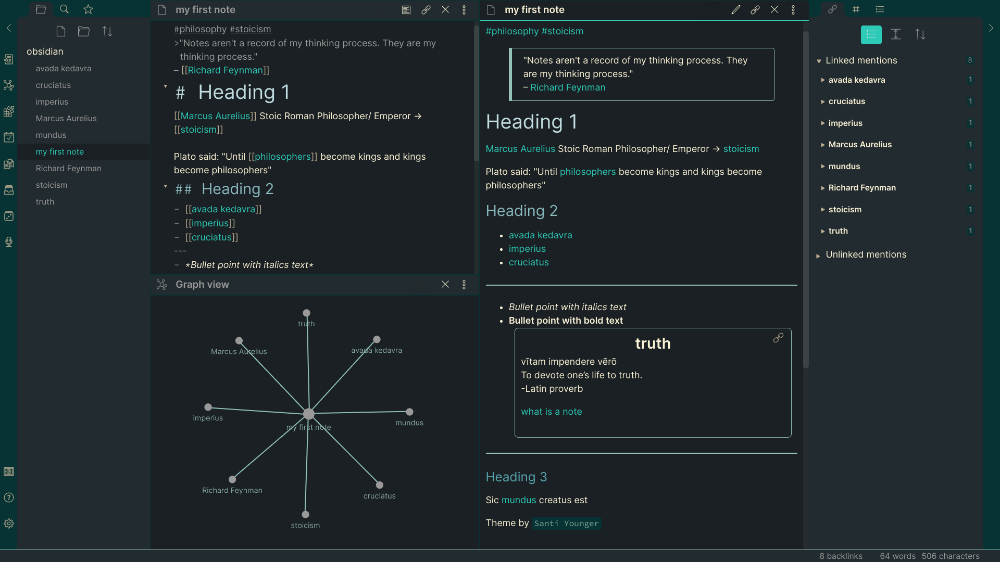
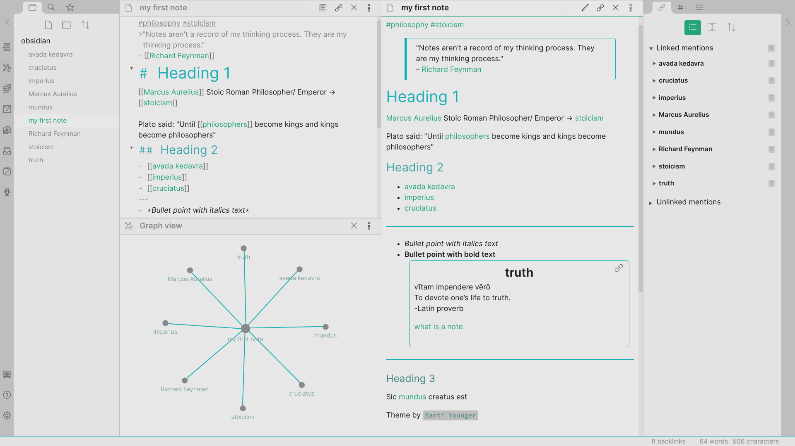

This theme is mainly designed for dark mode, but light mode works well too.

# Dark Mode

# Light Mode

If you like this theme, leave a comment on the [Obsidian Forum Post](https://forum.obsidian.md/t/theme-reverie-dark-light/6770) I made for it.

# Theme Name:
 ## Reverie 
 rev•er•ie rĕv′ə-rē

    n.
    A state of abstracted musing; daydreaming.
    n.
    A daydream.
    n.
    A state of mental abstraction in which more or less aimless fancy predominates over the reasoning faculty; dreamy meditation; fanciful musing.
