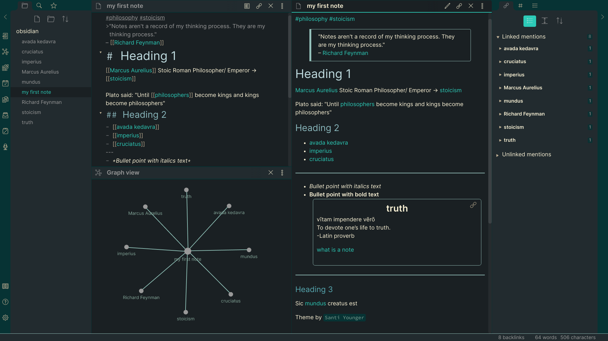
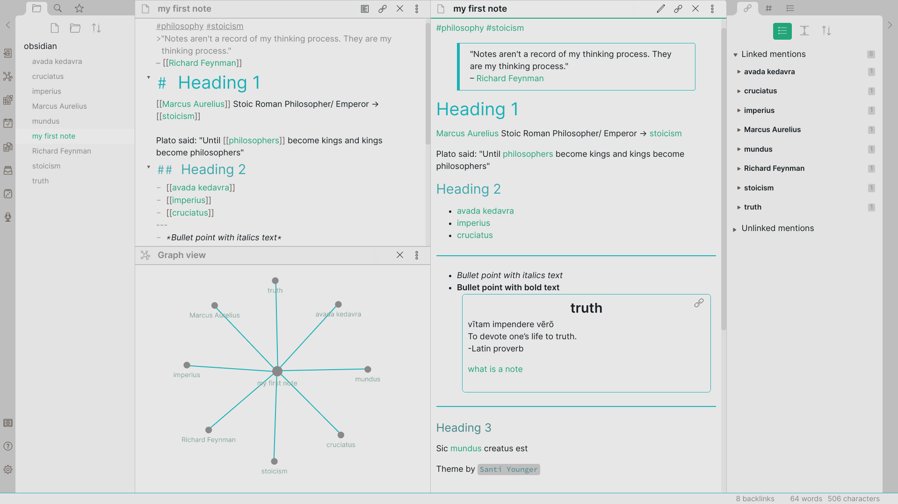

# Reverie — Obsidian Theme

This theme is mainly designed for dark mode, but light mode works well too.

## Dark mode



## Light mode



If you like this theme, leave a comment on the [Obsidian forum post](https://forum.obsidian.md/t/theme-reverie-dark-light/6770).

## Theme name

**Reverie** — *rev•er•ie* (*rĕv′ə-rē*)

> A state of abstracted musing; daydreaming. A daydream. A state of mental abstraction in which more or less aimless fancy predominates over the reasoning faculty; dreamy meditation; fanciful musing.

## Install

Reverie is available in **Obsidian Community Themes**.

1. Open **Settings → Appearance → Themes → Manage**.
2. Search for **Reverie** by Santi Younger.
3. Select **Use** (and **Overwrite** if prompted).

### Manual install (development)

Clone this repository into your vault’s themes folder. The folder name must match `name` in `manifest.json` (**Reverie**):

```bash
cd path/to/vault/.obsidian/themes
git clone https://github.com/santiyounger/Reverie-Obsidian-Theme.git Reverie
```

Restart Obsidian after changing `manifest.json`.

## Repository layout

| File | Purpose |
|------|---------|
| `theme.css` | Theme styles (installed by Obsidian) |
| `manifest.json` | Theme metadata for the community directory |
| `versions.json` | Maps theme versions to minimum Obsidian versions |
| `.github/workflows/release-version.yml` | Publishes a release when you push a version tag |
| `version-bump.mjs` | Keeps `manifest.json` and `versions.json` in sync with `package.json` |

See [Build a theme](https://docs.obsidian.md/Themes/App+themes/Build+a+theme) and [Submit your theme](https://docs.obsidian.md/Themes/App+themes/Submit+your+theme) in the Obsidian developer docs.

## Publishing a release

Community installs download `manifest.json` and `theme.css` from a **GitHub release** whose tag matches `version` in `manifest.json` (semver `x.y.z`, no `v` prefix).

### Automated (recommended)

Pushing a version tag creates a **draft** GitHub release with `manifest.json` and `theme.css` attached. Draft releases are not installable from Obsidian until you publish the release on GitHub (and the community directory has picked up the new version).

1. Bump the version (updates `package.json`, `manifest.json`, and `versions.json`):

   ```bash
   npm version patch
   ```

   Use `minor` or `major` instead of `patch` when appropriate.

2. Push the commit and tag (`npm version` creates both; `.npmrc` sets tags like `1.0.2` without a `v` prefix):

   ```bash
   git push origin master
   git push origin --tags
   ```

   The tag name must equal `version` in `manifest.json`.

3. On GitHub, open **Actions** → confirm **Publish new theme version** succeeded, then **Releases** → open the new **Draft** release and verify `manifest.json` and `theme.css` are attached.

4. When ready for users: on [community.obsidian.md](https://community.obsidian.md) (Themes → your theme profile), publish or approve the release there as required by the directory.

5. On GitHub, open the same draft release and click **Publish release** so Obsidian can install that version from GitHub.

Until step 5, the release stays a draft and community installs should not pick it up.

### Manual

1. Bump `version` in `manifest.json` and add an entry to `versions.json`.
2. Create a GitHub release with a tag equal to that version.
3. Attach `manifest.json` and `theme.css` to the release.

## Development

Edit `theme.css` at the repository root. Everything after the “End of main theme” comment is reserved for optional snippets or experiments.

### Dark palette

| Role | Hex |
|------|-----|
| Background | `#1A2023` |
| Accent | `#2ccab7` |
| Text | `#faf2d6` |

Use `body` for variables shared across light and dark. Use `.theme-dark` and `.theme-light` only when a value should change with the base color scheme. For graph view, set `--interactive-accent-rgb` as comma-separated RGB (not hex) and use `rgb(var(--interactive-accent-rgb))` on graph nodes.

Vim block cursor styling references:

- [Change block cursor color](https://forum.obsidian.md/t/how-to-change-block-cursor-color-vim-mode/7429/6)
- [Modify cursor style](https://forum.obsidian.md/t/options-to-modify-cursor-style/1091/11?u=santi)
- [Remove blink in vim mode](https://forum.obsidian.md/t/options-to-modify-cursor-style/1091/4?u=santi)

## Feedback

Hope you enjoy it. Share feedback on the [forum thread](https://forum.obsidian.md/t/theme-reverie-dark-light/6770).

## License

MIT — see [LICENSE](LICENSE).
